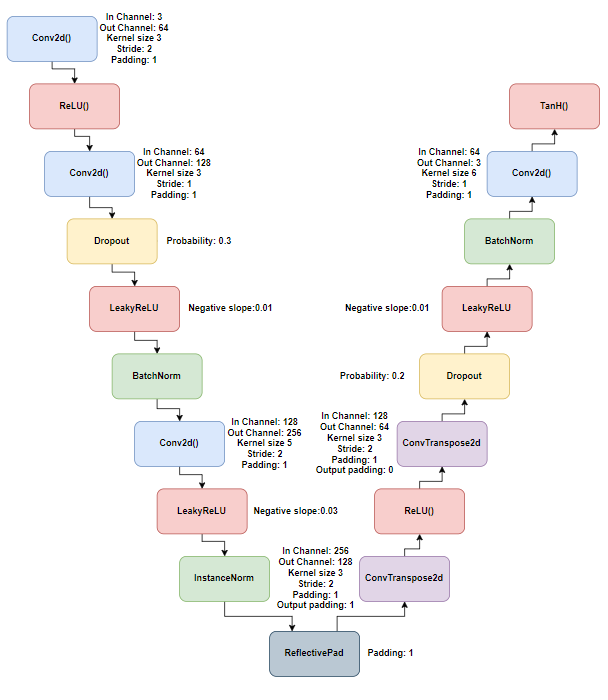
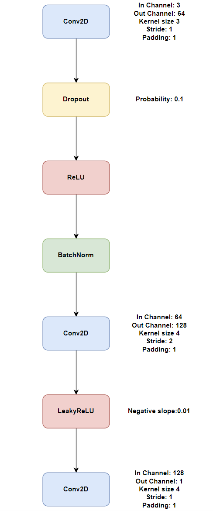
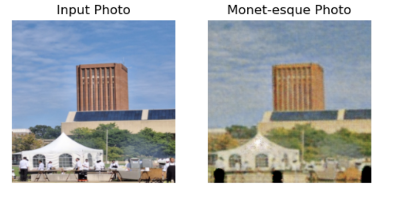

The goal of this project is to explore the problem of training
style transfer models for image generators. We also want to
explore image generation itself and create the most accurate
generated images that we can. We are doing so by exploring
and testing a Generative Adversarial Network architecture
called CycleGANs as the primary method for training style
transfer models. The dataset used is from the kaggle competition, <a href="https://www.kaggle.com/competitions/gan-getting-started">I am something of a painter myself</a>. The code used for training and testing the cycle gans were optimized from this <a href="https://www.kaggle.com/code/robinlutter/painting-with-gans">kaggle notebook</a> 

We have created a custom generator and discriminator architecture for the network. The generator is an autoencoder with downsampling layers and upsampling layers. While The discriminator layer is a collection of layers that are the same depth as the generator to prevent the discriminator from detecting all the images as fake given by the generator. Given below are the diagrams depicting the architectures of both the generator and the discriminator.

  
   

Various different optimizers and loss functions were tested to arrive at the best results in terms of producing monet esque photos. The most optimized model was tested with various real life images and the best result is displayed below:

  

Have a read of our <a href="https://drive.google.com/file/d/1NTxJ57DWavD5lSv9v2nzaK1mBGXmRfje/view?usp=sharing">paper</a> to know more about the different types of hyperparamters tuning that took place

